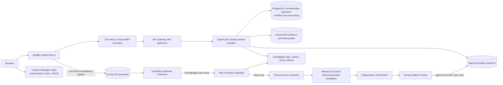

# INSIPS

INSIPS turns private evidence into specific, explainable trust signals for social-impact organizations. INSIPS Compass assists with extraction and candidate preparation; organizations confirm their own facts; independent platform reviewers decide each claim; and the public sees only current approvals with a meaning and review date.

This repository is the INSIPS submission for the IBM Bob 2.0 Hackathon. All people, organizations, documents, addresses, identifiers, review decisions, and activity shown in the demo are synthetic.

## What works locally

- Responsive public landing page, discovery, organization profile, and trust explainer.
- Organization readiness dashboard, profile editor, evidence list, staged processing timeline, Compass candidate confirmation, and review submission.
- Platform review queue, claim-by-claim source comparison, approve/reject/request-changes decisions, and approved-only public presentation.
- CSR discovery and a browser-local shortlist.
- Cognito-backed production identity architecture with signup, verification, recovery, session refresh, account archival, seven coarse groups, and optional Google, Facebook, and Apple federation. Local development uses a clearly labelled test adapter.
- Resumable ten-step organization onboarding, private document verification, attributed admin decisions, correction and resubmission, and organization lifecycle controls.
- Test-mode money donations with a 25-basis-point platform fee, captured-payment progress, idempotent webhooks, refunds, Route transfer states, donor and organization histories, receipts, QR codes, and CSV exports.
- Quantity-based item donations, volunteers, events, follows, bookmarks, organization updates, corporate shortlists, team invitations, notifications, and analytics using synthetic fixtures.
- Light and dark themes, keyboard-visible focus, reduced-motion support, mobile workspace navigation, intentional empty states, and safe fixture labelling.
- Strict schemas, document and claim state transitions, deny-by-default role/tenant policy, and tests for the highest-risk publication rules.
- AWS CDK for Cognito, HTTP API/Lambda, DynamoDB, private S3, conditional GuardDuty Malware Protection, EventBridge, Step Functions, Textract, Bedrock, CloudWatch, and a conditional AWS Budget.

The current production preview is available at [main.d1pi8v4nifv0bv.amplifyapp.com](https://main.d1pi8v4nifv0bv.amplifyapp.com/). The deployed API health endpoint is [h3776pj94e.execute-api.ap-south-1.amazonaws.com/health](https://h3776pj94e.execute-api.ap-south-1.amazonaws.com/health).

The local experience is intentionally labelled as a synthetic fixture. It does not claim that GuardDuty, Textract, Bedrock, Cognito, PostgreSQL, DynamoDB, or Razorpay ran locally.

## Product preview


## Route inventory

- Public: `/`, `/discover`, `/causes`, `/causes/[slug]`, `/items`, `/volunteer`, `/events`, `/feed`, `/organizations/[slug]`, `/for-organizations`, `/for-corporate-teams`, `/how-trust-works`, `/trust-methodology`, `/compass`, `/resources`, `/faq`, `/security-privacy`, `/help`, `/about`, `/contact`, and `/hackathon`.
- Authentication and account: `/auth/sign-in`, `/auth/sign-up`, `/auth/verify-email`, `/auth/forgot-password`, `/auth/reset-password`, `/auth/callback`, `/auth/session-expired`, `/account`, `/notifications`, and `/demo`.
- Organization: `/app`, `/app/onboarding`, `/app/profile`, `/app/evidence`, `/app/evidence/[id]`, `/app/submission`, `/app/donations`, `/app/items`, `/app/volunteers`, `/app/team`, and `/app/analytics`.
- Donor, corporate, and platform administration: `/donor`, `/donor/donations`, `/donor/donations/[id]`, `/donor/items`, `/corporate`, `/corporate/discover`, `/corporate/shortlist`, `/corporate/matching`, `/admin`, `/admin/organizations`, `/admin/organizations/[id]`, and `/admin/donations`.
- Legal and resilient states: `/privacy`, `/terms`, `/cookies`, `/donation-refund-policy`, `/acceptable-use`, `/accessibility`, `/security`, `/forbidden`, `/offline`, plus global loading, error, and not-found UI. Legal copy is a hackathon draft requiring professional review.

## Architecture



Security-critical boundaries:

- Browser identity is never trusted as authorization. API Gateway verifies the Cognito JWT; Lambda then loads tenant membership and permissions from PostgreSQL. Cognito groups provide coarse roles only.
- Razorpay webhooks use a separate signature-verifying handler and a PostgreSQL unique event key so retries cannot increase progress twice. All payment infrastructure remains in test mode until explicitly approved.
- A GuardDuty `NO_THREATS_FOUND` event is the only scan result routed into extraction. `THREATS_FOUND`, `UNSUPPORTED`, `ACCESS_DENIED`, and `FAILED` remain blocked.
- Extracted text is untrusted. Compass has no tools, receives a bounded prompt, and its JSON must pass the shared Zod schema.
- Review decisions are separate records. Updating an approved source value invalidates the public projection until re-review.

## Repository

```text
apps/web/                  Next.js App Router product
infra/                     AWS CDK and Lambda handlers
packages/contracts/        schemas, state machines, policy, public projection
docs/                      decisions, data model, security, costs, demo, submission
output/pdf/                safe synthetic evidence fixture
scripts/                   repeatable fixture generation
```

## Local setup

Prerequisites: Node.js 22, pnpm 11.19.0, and Python with ReportLab only when regenerating the PDF.

```bash
pnpm install --frozen-lockfile
cp .env.example .env.local
pnpm dev
```

Open `http://localhost:3000`. The local evidence flow stores synthetic decisions under `insips-demo-v1`; the expanded product-flow fixture uses `insips-product-demo-v1`.

### Local demo roles

`/demo` is a clearly labelled synthetic role launcher, separate from the polished authentication presentation. The local identity adapter supports signup, verification, sign-in, recovery, refresh, logout, and account archival without pretending to be Cognito; the UI labels its test codes. These role switches and browser fixtures are not an authorization boundary. In production, Cognito verifies identity and each backend request loads active PostgreSQL tenant membership before authorizing access.

## Checks

```bash
pnpm lint
pnpm typecheck
pnpm test
pnpm build
pnpm --filter @insips/web e2e
```

The contracts suite covers tenant isolation, suspended membership denial, self-approval denial, reviewer assignment, expired sessions, clean-before-extract transitions, claim review transitions, approved-only publication, stale-approval invalidation, restricted-field removal, 25-basis-point fee calculation, idempotent capture/refund accounting, item donations, and volunteer states. CDK assertions cover private storage, encryption, DynamoDB recovery, Cognito signup and groups, encrypted PostgreSQL, the Razorpay webhook boundary, Node.js 22 Lambdas, the Step Functions workflow, and the GuardDuty event boundary.

The DynamoDB access patterns and key design are recorded in `docs/DYNAMODB.md`; keys were derived from those access patterns rather than guessed from screens. `docs/OPERATIONS.md` is the CloudWatch-safe troubleshooting runbook.

## AWS deployment

The current AWS deployment uses the existing `Insips-dev` stack in `ap-south-1` and Amplify Hosting for Next.js SSR. The stack is managed manually from an authenticated AWS CLI profile; no CI/CD workflow, worker, or always-on server is required by this repository.

For a new environment, authenticate without placing credentials in source files and deploy the infrastructure with explicit cost and feature parameters:

```bash
aws sso login --profile YOUR_PROFILE
pnpm --filter @insips/infra synth
pnpm --filter @insips/infra deploy -- --profile YOUR_PROFILE \
  --parameters AppOrigin=https://YOUR_AMPLIFY_DOMAIN \
  --parameters EnableMalwareProtection=true \
  --parameters BedrockModelId=VERIFIED_MODEL_OR_INFERENCE_PROFILE \
  --parameters MonthlyBudgetUsd=APPROVED_AMOUNT \
  --parameters BudgetEmail=APPROVED_EMAIL
```

The deployment intentionally defaults malware protection off and the budget amount to zero. That makes unresolved cost decisions visible instead of silently enabling a paid workflow. `docs/COSTS.md` contains the service-by-service model and shutdown procedure. Live Cognito federation and Razorpay transactions require their provider configuration and should be smoke-tested separately before being described as live capabilities.

Amplify Hosting is connected to the public GitHub repository using `amplify.yml`. This project pins Next.js 15 with React 19 for managed SSR; see `docs/DECISIONS.md`.

## Demo data and reset

The safe PDF fixture is `output/pdf/Synthetic_CSR-1_Certificate.pdf`. Regenerate it with:

```bash
python3 scripts/create_synthetic_pdf.py
```

Reset the browser demo by deleting the `insips-demo-v1` local-storage item or clearing site data. The exact three-minute path and backup plan are in `docs/DEMO.md`.

## Current limitations

- The production preview and API health endpoint are deployed, but live Cognito federation and Razorpay payment flows remain configuration-dependent and are not represented as completed live transactions.
- Cognito is the only production identity provider. Local development uses an explicit test adapter; federation appears only when credentials are configured.
- Aurora PostgreSQL and its schema migration are synthesized but not deployed. DynamoDB remains limited to the existing evidence-processing state.
- The Next.js BFF/domain API connection, live presigned upload endpoint, and durable review writes remain release work beyond the current deployment preview.
- The user-supplied pre-existing INSIPS logo is included at the owner's explicit direction; broader redistribution terms remain the owner's responsibility.
- The synthetic pipeline UI demonstrates the intended states; it never labels fixture data as a live AWS result.

## Teardown

Review the target account and region twice, then require explicit owner confirmation before running:

```bash
pnpm --filter @insips/infra destroy -- --profile YOUR_PROFILE
```

The evidence bucket has deletion protection through retained objects: `autoDeleteObjects` is false. Emptying or deleting evidence is intentionally a separate destructive manual action.

## Hackathon disclosure

Product decisions and submission claims require human verification. Pre-existing concept and screenshot references were used only for planning and visual direction. See `CREDITS.md` for libraries, licences, and asset status.
